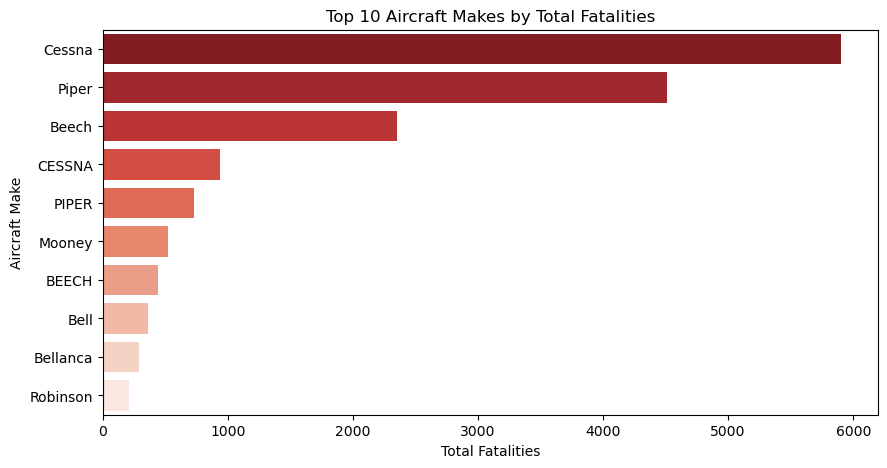
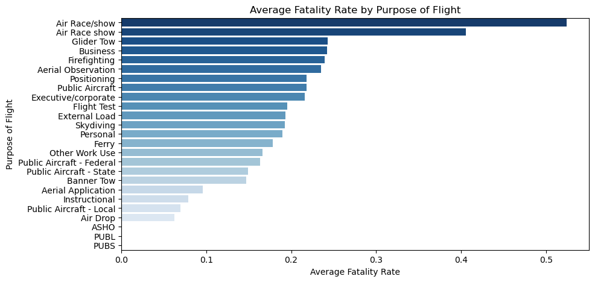
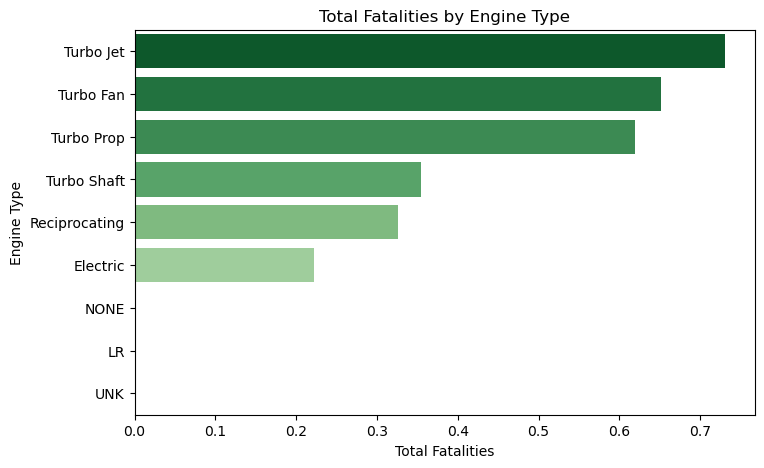
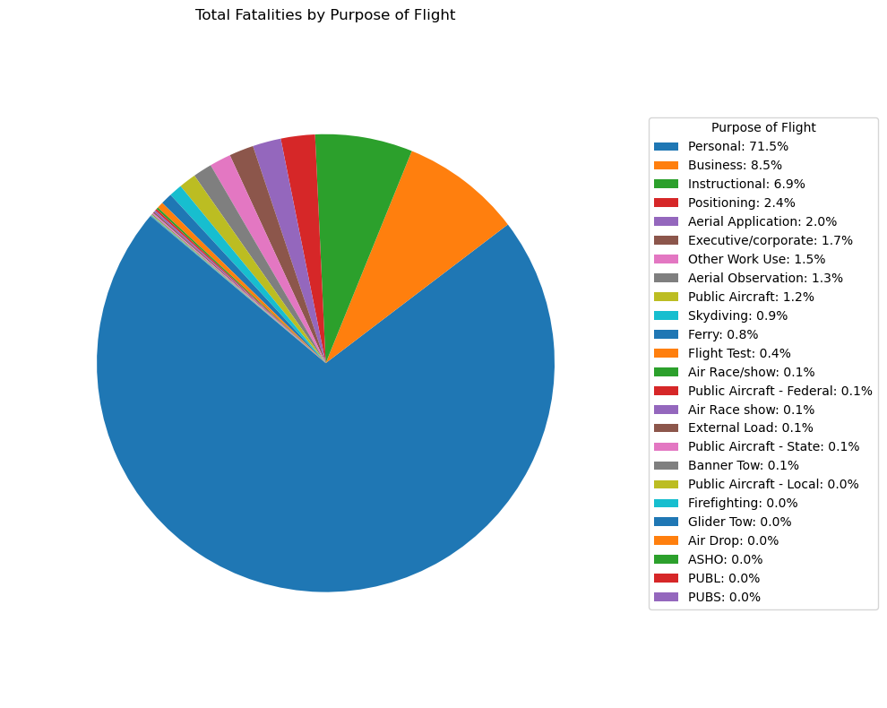

## Final Project Submission

Please fill out:
* Student name: James Maurice Owiti
* Student pace: full time
* Scheduled project review date/time: Sat 4th Oct 6pm
* Instructor name: Nikita Njoroge

# PROJECT OVERVIEW

## PHASE 1 PROJECT
This project analyzes aviation accident data to uncover patterns in aircraft safety, focusing on accident frequency, severity, and fatalities across different models, manufacturers, flight purposes, and engine types.

## PROBLEM STATEMENT
The aviation industry faces critical challenges in fleet safety management and accident risk mitigation. Despite advances in technology, aviation accidents continue to result in significant fatalities, with varying risk levels across different aircraft types, manufacturers, and operational purposes. Aviation stakeholders, including airlines, fleet managers, and insurance providers, lack comprehensive data-driven insights to guide aircraft acquisition decisions, prioritise safety interventions, and allocate resources effectively. Without understanding which aircraft models, engine types, and flight operations carry the highest risk, companies may inadvertently invest in higher-risk assets or fail to implement targeted safety measures where they're most needed. This gap in actionable intelligence exposes organisations to increased operational risk, higher insurance costs, potential regulatory penalties, and, most critically, preventable loss of life. The absence of systematic risk analysis across the aviation fleet threatens both business sustainability and public safety.

## ABOUT OUR DATASET
In the data folder is a dataset from the National Transportation Safety Board that includes aviation accident data from 1962 to 2023 about civil aviation accidents and selected incidents in the United States and international waters.

### Feature Engineering
In this step, we create new columns to support our analysis:
* Total.Aboard → Total number of people on board (sum of all injuries and uninjured).
* Fatality.Rate → Proportion of people who died relative to those on board.
* Make_Model → Combined aircraft make and model for easier grouping.
* Fatalities → Alias for total fatal injuries (for visualization and aggregation)
Change to markdown

### We filter out rows that contain meaningless entries such as 0 or Unknown

### VISUALIZATION OF OUR ANALYSIS

**Top 10 Aircraft Makes by Total Fatalities**

A horizontal bar chart ranking the 10 aircraft manufacturers with the highest total fatalities. While higher counts may reflect market share rather than poor safety, this analysis helps inform procurement decisions and identify manufacturers requiring closer safety evaluation.

### Visualization #2
**Average Fatality Rate by Purpose of Flight**

A horizontal bar chart showing which flight purposes (Personal, Commercial, Training, etc.) have the highest average fatality rates when accidents occur. This helps identify high-risk operations that may need enhanced safety measures and informs business decisions around insurance and operational policies.

### Visualization #3
**Total Fatalities by Engine Type**

A horizontal bar chart displaying the cumulative fatalities associated with each engine type (Reciprocating, Turbo Prop, Turbo Jet, etc.). This analysis helps identify which engine types have the highest historical fatality counts, informing fleet safety decisions and maintenance priorities.

### Visualization #4

**Total Fatalities by Purpose of Flight**

A pie chart showing the percentage distribution of total fatalities across different flight purposes (Personal, Commercial, Training, etc.). This reveals which operations account for the largest share of accident deaths, helping prioritize safety investments and resource allocation.

## KEY TAKEAWAYS
Accident frequency differs by brand, offering insights for buyers, operators, and regulators.

Safety risks are not uniform;  some flight purposes carry greater fatality risks than others.

Fatality rates reveal hidden risks that raw accident counts may not show.

Understanding which engine types are associated with higher fatalities supports better decision-making in aircraft operations and procurement.

## This is the link to the Tableu Public

